## Data everywhere


---

## But why ? 


---

## Définition-ish


---

## Tour de table
- Léo
- Vous !
  
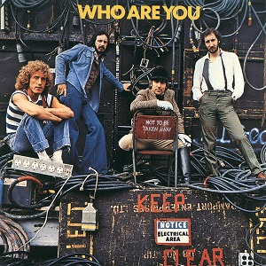{style="display:block; margin:auto;"}

---

## Moi

<!--
COMPLÉTER
-->

---

## Vous
<!--
- Name?
- Field of study?
- Interests?
- Previous experience with R?
- Why are you interested in this course? (Are you?)
- Who knows that you are here right now? (think of the data you generating)
-->

---

## Organisation du cours
- Le [syllabus](https://github.com/leomignot/methodes-computationnelles/) précise tout ça
- Le passer en revue ensemble

---

## Je code comme une brouette

::: {.columns}
::: {.column width="50%"}
{style="display:block; margin:auto; width: 400px;"}
:::

::: {.column width="50%"}
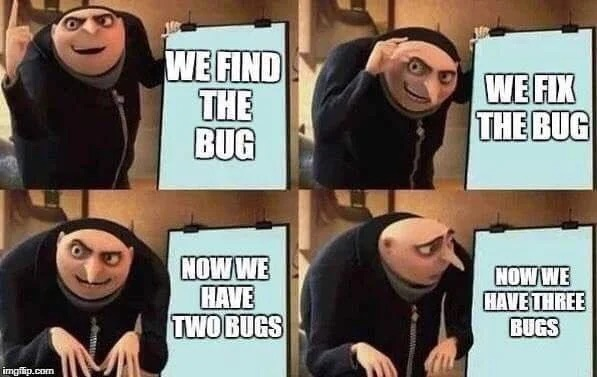{style="display:block; margin:auto;"}
:::
:::

---

## Sucking
[Andrew Heiss : sucking](https://datavizsp25.classes.andrewheiss.com/slides/01-slides.html#58)

- Normal d'avoir des erreurs
- Importance des petites victoires
- Vos enseignants aussi galèrent

> "Push through. You’ll suck less."
> 
> (Hadley Wickham, author of {ggplot2})

---

## Programme du jour

- D'abord répondre à **3 questions**
    1. Pourquoi programmer (en recherche) ?
    2. Pourquoi Python ?
    3. Comment s'y mettre ?

- Puis mettre les mains dans le cambouis

# Pourquoi programmer (en recherche) ?

---

## La numérisation de la science

- Numérisation comme point de passage obligé 
- Explosion et circulation des données
    - Comment les actionner ?
- Courant profond et puissant de la science ouverte
    - Reproductibilité
- Nouvelles méthodes & terrains en SHS
    - NLP...

---

## La programmation scientifique

- **Script** : réaliser des petites tâches spécifiques
- **Interactivité** : tester et expérimenter
- **Spécificité** : des outils spécifiques
- **Temporaire** : évolution permanente
- **"Amateurisme"** : pas le coeur de métier

::: {style="font-size: 70%;"}
« in contrast to software engineering, there is no externally specified goal or design target. Instead, the user explores and discovers their goal as they gain understanding from iteratively executing the code and thinking about the results and their data. » (Granger et Perez, 2021) 
:::


---

## Les raisons de programmer en recherche

- Formaliser et automatiser son traitement
- Dépasser ce qui est prévu dans les logiciels
- Construire des outils pour soi et les autres
- Utiliser les ressources que d'autres développent
- Mieux maîtriser l'infrastructure numérique en général

---

## Un pont vers la reproductibilité

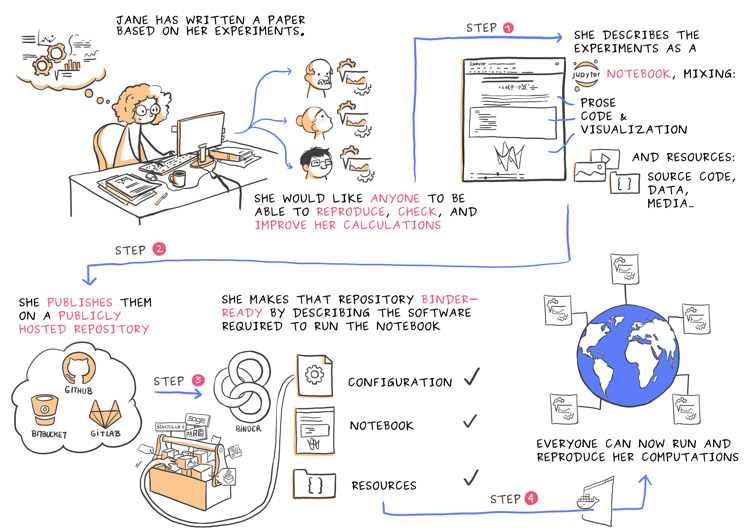{style="display:block; margin:auto;"}

::: {style="font-size: 50%;"}
 Juliette Taka, & Nicolas M. Thiéry. (2018). Publishing reproducible logbooks explainer comic strip. Zenodo. <https://doi.org/10.5281/zenodo.4421040>
:::

## Non exclusif avec les logiciels

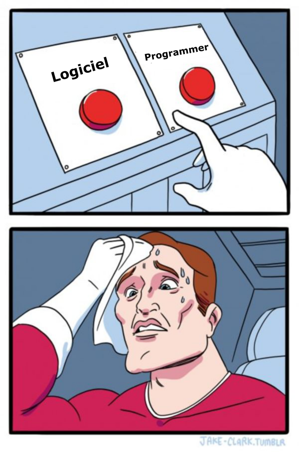{style="display:block; margin:auto;"}

## Donc : un apprentissage multiniveaux

- Se familiariser aux environnements informatiques
    - Ligne de commande, ...
- Penser la structures des données et leur diversité
    - Format de fichier : csv ou xls ?
- Penser la matérialité des pratiques
    - Stockage mémoire vive, cloud ou disque dur ?

# Pourquoi Python ?

---

## Parce que tout est possible

{style="display:block; margin:auto;"}

---

## Et plus généralement

- Libre et interopérable
- Polyvalent
- Pédagogique par design
- Enseigné de plus en plus tôt
- Le plus utilisé en traitement des données
    - [Sondage stackoverflow](https://survey.stackoverflow.co/2023/#technology-most-popular-technologies) ; [TIOBE index](https://www.tiobe.com/tiobe-index/) ; [Github](https://github.blog/news-insights/octoverse/octoverse-2024/)
---

## Une lingua franca

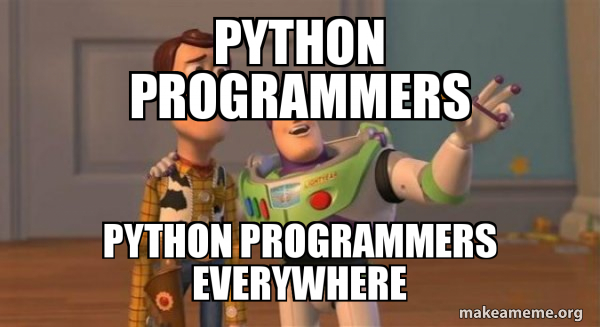{style="display:block; margin:auto;"}

---

## Python : un langage & un écosystème

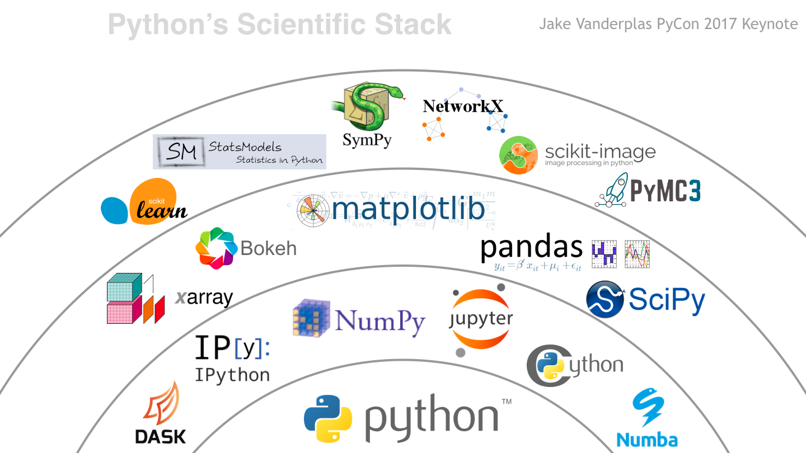{style="display:block; margin:auto;"}


# Comment s'y mettre ?

---

## Au commencement : un choix

Une diversité d'outils adaptés à des pratiques différentes

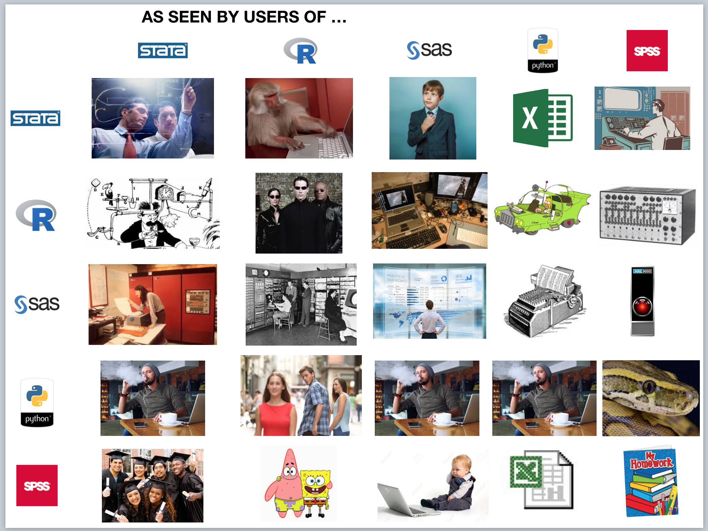{style="display:block; margin:auto;"}

---

## Une question récurrente

::: columns

:::: column
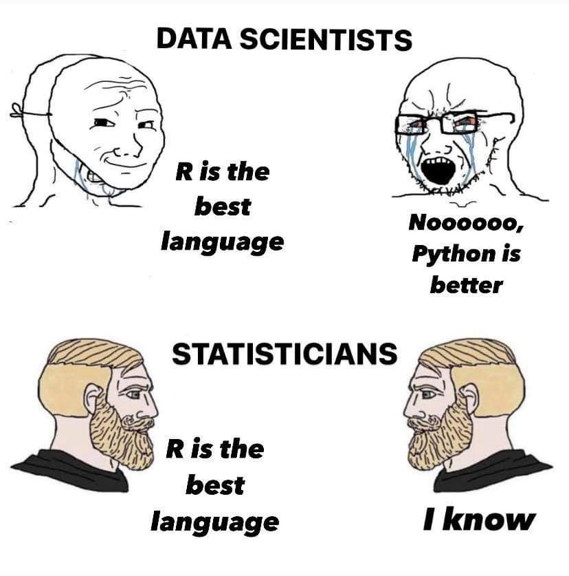
::::

:::: column
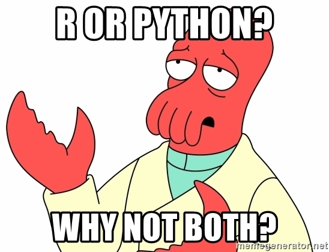
::::

:::


---

## Python ou R ? Des points communs


::: columns

:::: column
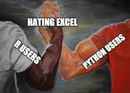{width=150%}
::::

:::: column

- Python et R ++ pour traitement de données
- Python ++ interface informatique/privé
- R ++ pour statistiques
- Python ++ pour ML
- Python ++ production

::::

:::

*"the best second langage"*


---

## La particularité des SHS

::: columns

:::: column
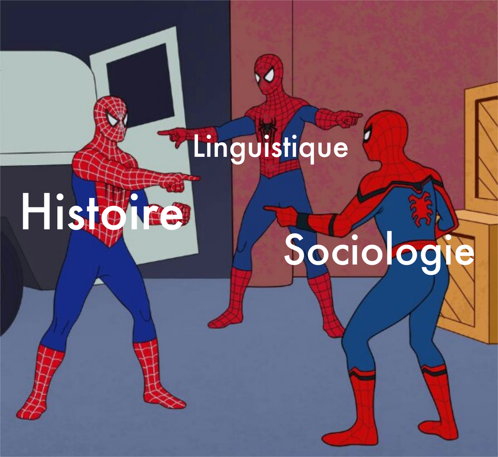
::::

:::: column

- centralité de la problématique
- diversité de méthodes
- diversité des données
- diversité de cultures numériques 
    - des communautés très computationnelles
    - d'autres moins ...

::::
:::

---

## Programmer, pour faire quoi ?

Important de construire une idée de ce qu'on peut faire.

Un vaste panorama de possibilités

- des petites tâches
- des opérations "discrètes"
- des nouvelles opérations
- de nouvelles collaborations

**Différents types d'usages**

---

## Usages "orientés mimétisme"

- Suivre un tutoriel
    - ["Whisper pour retranscrire des entretiens", Yacine Chitour](https://www.css.cnrs.fr/whisper-pour-retranscrire-des-entretiens/) 
- Utiliser une ligne de commande pour lancer une collecte de données avec un outil dédié
    - feu Twark pour Twitter
- Lancer le code d’un notebook existant avec des modifications mineures

```{.python}
import scripttoutfait
scripttoutfait.run()
```

---

## Usages "orientés scripts"

- Manipuler des données
    - Découper un fichier trop volumineux
- Transformer des données
    - Pour Iramuteq ou pour l’analyse de réseaux (mise en forme de corpus)
- Automatiser des tâches
    - Conversion pdf > textes

- Script dans logiciel
    QGIS ou dans OpenRefine

---

## Usages "orientés statistiques"

- Construire un graphique
    - Juxtaposition de plusieurs éléments temporels
- Faire des statistiques
    - Notebook permettant l’exploration statistique des données d’une enquête en ligne
- Exploration de textes
    - Bibliothèques de TAL pour analyse thématique
- Parallélisation des calculs sur des serveurs

---

## Usages "orientés automatisation"

- Systématiser des collectes API
    - OCR Gallica, forums...
- Surveillance d'événements
    - Modifications d’un site
- Workflow exécutable
    - Ensemble des étapes collecte/analyse/résultats
- Déployer un site web en Python

---

## Usages "orientés IA"

- Requêter les API (OpenAI, etc.)
- Manipuler les modèles
    -   Possibilités ouvertes par HuggingFace & co
- Entraîner des modèles
    - Détection d'entitées nommées à façon
    - Fine tuner des LLM

---

## Usages "orientés instrumentation"

- Généraliser son code en fonction ré-exécutable
- Publier une bibliothèque
- Déployer un service en ligne

---

## Usages "orientés logiciel"

- Développer une bibliothèque dédiée générique (Ipysigma)
- Développer un module pour un logiciel (QGIS?)
- Développer des interfaces spécifiques
    - Mettre un modèle en service

---

## Donc, tous programmeurs.euses ?

- Non
    - Et pas nécessairement en Python
- Mais une culture numérique devient indispensable
- Cela facilite les échanges
- Et une adaptation aux évolutions
    - LLM, IA, tralala

**Les LLM changent (un peu) la donne (???)**

---

## Conception étendue de la programmation

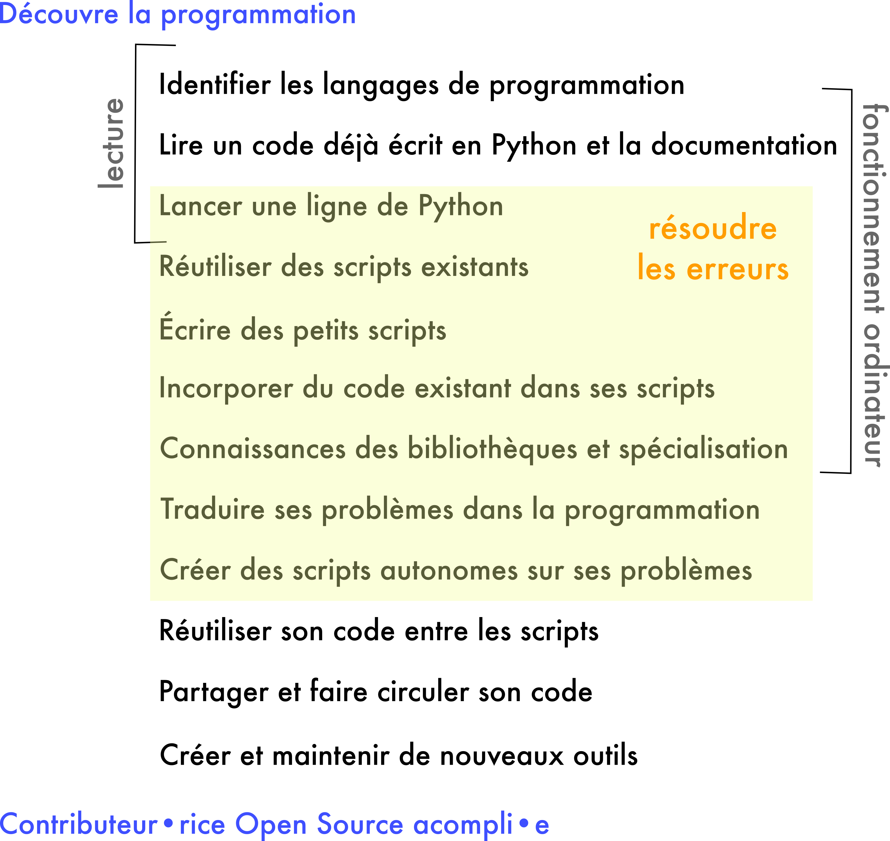{style="display:block; margin:auto;"}

---

## Ressources

::: columns

:::: column
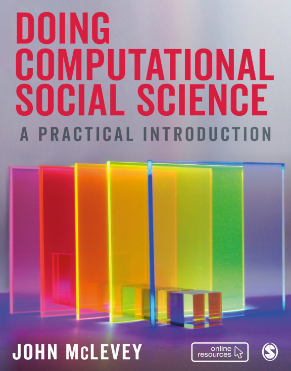{style="display:block; margin:auto; width:40%"}
::::

:::: column

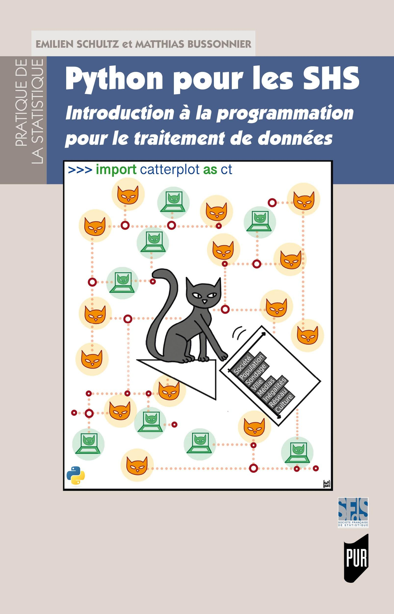{style="display:block; margin:auto; width:40%"}

::::
:::

- [Online : Python pour la data science, Lino Galiana](https://pythonds.linogaliana.fr/)
- [Online : Python for cultural studies, Melanie Walsh](https://melaniewalsh.github.io/Intro-Cultural-Analytics/welcome.html)
- [Online : Introduction à la programmation Python pour la biologie, de Patrick Fuchs et Pierre Poulain](https://python.sdv.u-paris.fr/)


# Exécuter du code

## Notebooks computationnels ?

Philosophie générale de la programmation lettrée

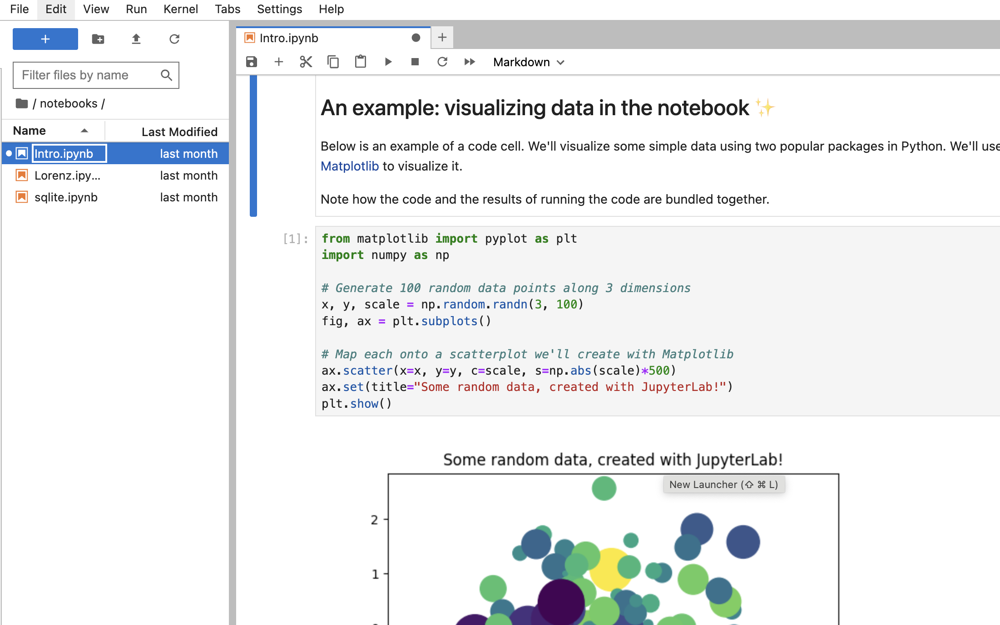{style="display:block; margin:auto"}

[Préprint : Du laboratoire à Jupyter : La trajectoire d'un instrument logiciel libre de la science ouverte, 2023](https://hal.science/hal-04316428/)

---

## Nous : notebooks Jupyter

- Ludique et interactif
- Avoir tous les éléments au même endroit
- Très utilisés (["Ten computer codes that transformed science", Nature, 2021](https://www.nature.com/articles/d41586-021-00075-2))

Quelques limites :

- Orde d'exécution des cellules
- Vite confus

Si vous voulez des critiques : [I don't like notebooks - Joel Grus](https://www.youtube.com/watch?v=7jiPeIFXb6U)

---

## Depuis quel outil ?


(Dans le cadre du cours, google colab, mais aperçu d'autres possibilités) :

- **Anaconda** : [https://www.anaconda.com/products/individual](https://www.anaconda.com/products/individual)
- **Google Colab** : [https://colab.google/](https://colab.google/)
- **SSPcloud (INSEE)** : [https://datalab.sspcloud.fr](https://datalab.sspcloud.fr)

Plus avancés :

- [uv](https://docs.astral.sh/uv/) ; [poetry](https://python-poetry.org/) ; etc.


<!-- Ces slides (et plus généralement les formations) sont le résultat d'échanges et de collaborations. 

Ont largement participé :

- Emilien Schultz
- Léo Mignot
- Matthias Bussonnier
- Mathieu Morey
- Mickael Temporão
-->
